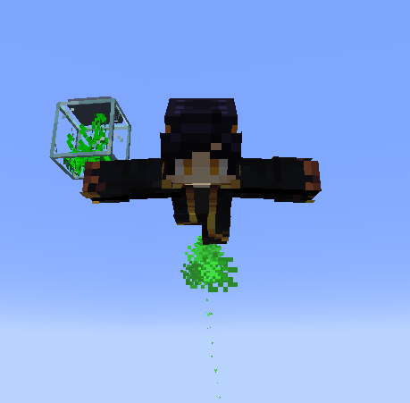
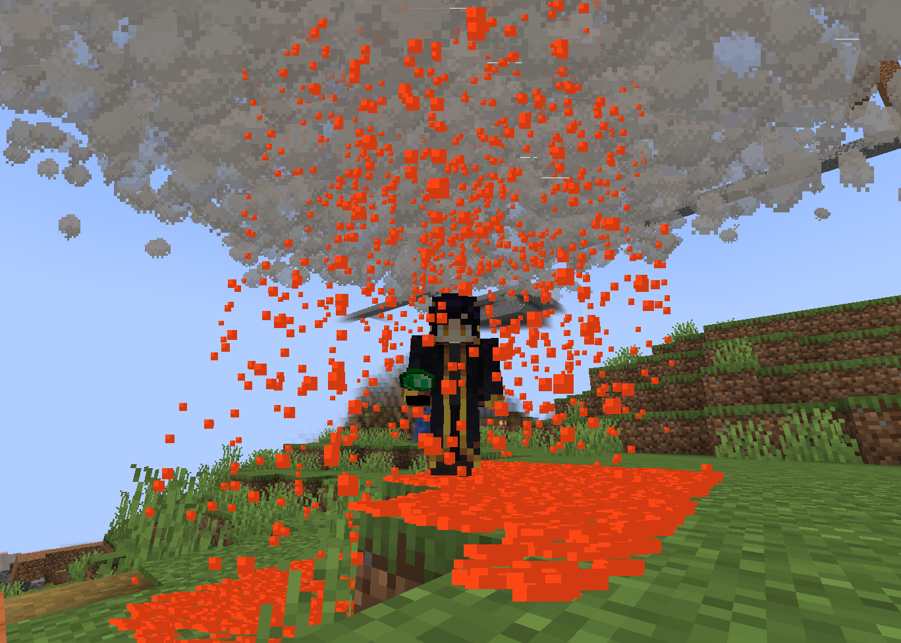
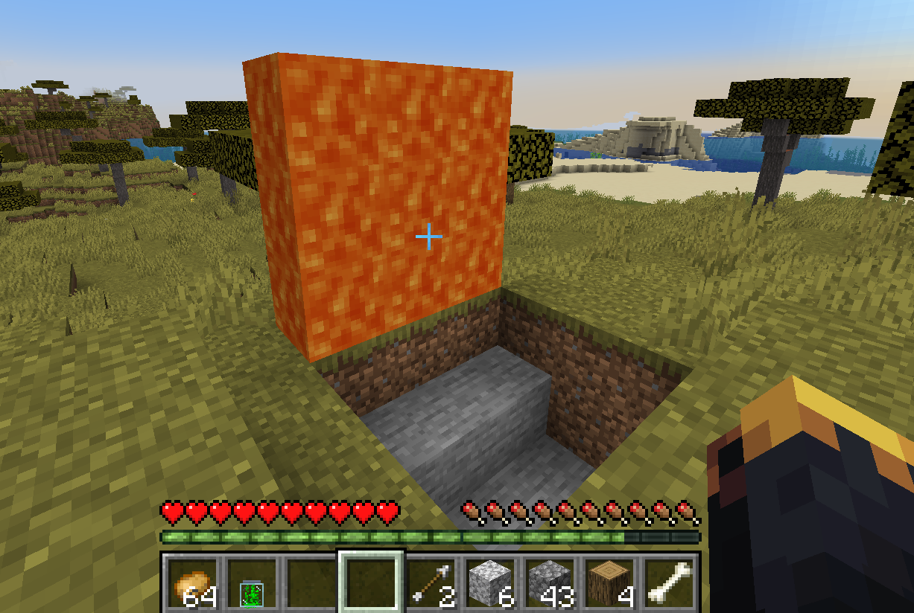

# DYNAMIC WORLD EVENTS

Experimental Minecraft gameplay framework focused on dynamic environmental hazards, interactive trap systems, and unpredictable multiplayer gameplay events.

---

## Overview

This project introduces a collection of event-driven gameplay mechanics designed to create chaotic, unpredictable, and interactive survival experiences inside Minecraft.

The mod focuses on environmental interactions, player traps, and custom gameplay events rather than traditional content expansion.

---

## Features

- Dynamic environmental hazard events
- Interactive disguised trap systems
- Custom gameplay interaction mechanics
- Physics-inspired mobility items
- Multiplayer-focused gameplay scenarios
- Event-driven world mechanics
- Custom visual and gameplay effects

---

## Gameplay Systems

The project is designed around creating unexpected gameplay moments through dynamic world interactions and player-triggered mechanics.

Included systems:
- Lava rain world events
- Interactive disguised traps
- Custom mobility mechanics
- Hazard-based gameplay events
- Survival interaction systems

---

## Technical Overview

- Event-driven gameplay architecture
- Client/server interaction handling
- Modular gameplay system structure
- Custom world event processing
- Optimized gameplay logic
- Multiplayer-safe event synchronization

---

## Preview

  

  

  

---

## Status

Active experimental gameplay project under continued development.
